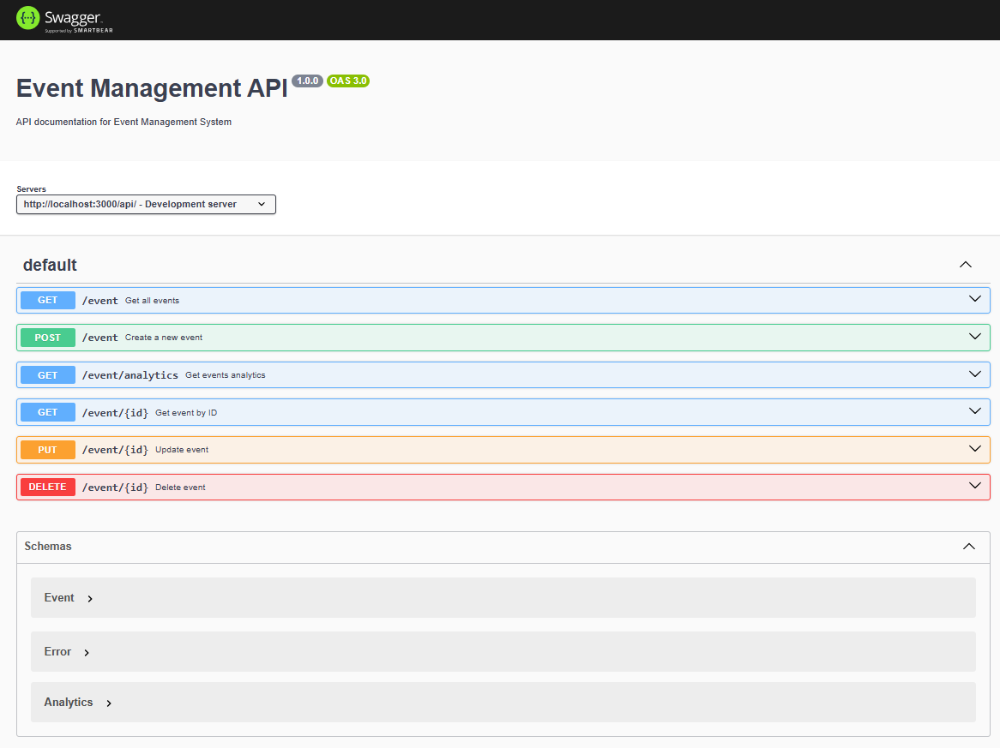

# Event Management API

## Swagger Doc
Swagger is accessible at `<base-address>/api-docs`. You can try the supported Http Action Methods. 


## Running App using Docker Compose 
1. Clean previous setup (if needed): `npm run docker:clean`
2. Start the containers `npm run docker:up`
3. Access Swagger docs `http://localhost:3000/api-docs`
4. Check MongoDB data `docker exec -it event-management-db mongosh -u eventuser -p eventpass event-management`

### Additional Docker Command
1. Remove all containers and volumes `npm run docker:clean`
2. Rebuild containers `npm run docker:build`
3. Start in detached mode `docker-compose up -d`

## Running App Locally 
1. Copy the local env file `cp .env.local .env`
2. Install dependencies `npm install`
3. Start the application `npm run dev`

# Sample Request/Response
## **Get All Events** 
```curl
curl -X 'GET' \
  'http://localhost:3000/api/event?page=1&limit=10&sortBy=dateTime&sortOrder=asc&search=tech' \
  -H 'accept: application/json'
```
* **sortBy**: [name, dateTime, status, location]
* **sortOrder**: [asc, desc]
* **status**: [Upcoming, Ongoing, Completed]
* If Search field is empty all records are fetched
* **Success Response**
```json
{
  "success": true,
  "message": "Events retrieved successfully",
  "data": {
    "events": [
      {
        "_id": "6783665833e4f6dfc4964037",
        "name": "Developer Summit 2023",
        "dateTime": "2023-11-01T09:00:00.000Z",
        "location": "Tech Hub",
        "status": "Completed",
        "createdAt": "2025-01-12T06:51:04.816Z",
        "updatedAt": "2025-01-12T06:51:04.816Z"
      },
      {
        "_id": "6783665833e4f6dfc4964038",
        "name": "Tech Conference 2025",
        "dateTime": "2025-06-15T09:00:00.000Z",
        "location": "Convention Center",
        "status": "Upcoming",
        "createdAt": "2025-01-12T06:51:04.816Z",
        "updatedAt": "2025-01-12T06:51:04.816Z"
      }
    ],
    "pagination": {
      "total": 2,
      "page": 1,
      "limit": 10,
      "totalPages": 1
    }
  }
}
```

## **Get Event By Id** 
```curl
curl -X 'GET' \
  'http://localhost:3000/api/event/6783665833e4f6dfc4964033' \
  -H 'accept: application/json'
```
**Success Response**
```json
{
  "success": true,
  "message": "Event retrieved successfully",
  "data": {
    "_id": "6783665833e4f6dfc4964033",
    "name": "Annual Meeting 2023",
    "dateTime": "2023-03-10T10:00:00.000Z",
    "location": "Headquarters",
    "status": "Completed",
    "createdAt": "2025-01-12T06:51:04.816Z",
    "updatedAt": "2025-01-12T06:51:04.816Z"
  }
}
```
## Get Event Analytics
```curl 
curl -X 'GET' \
  'http://localhost:3000/api/event/analytics' \
  -H 'accept: application/json'
```
**Success Response**
```json
{
  "success": true,
  "message": "Analytics retrieved successfully",
  "data": {
    "totalEvents": 7,
    "statusBreakdown": {
      "Completed": 3,
      "Upcoming": 4
    },
    "nextUpcoming": {
      "_id": "6783665833e4f6dfc4964038",
      "name": "Tech Conference 2025",
      "dateTime": "2025-06-15T09:00:00.000Z",
      "location": "Convention Center",
      "status": "Upcoming",
      "createdAt": "2025-01-12T06:51:04.816Z",
      "updatedAt": "2025-01-12T06:51:04.816Z"
    }
  }
}
```
## Create a new Event 

```curl 
curl -X 'POST' \
  'http://localhost:3000/api/event' \
  -H 'accept: application/json' \
  -H 'Content-Type: application/json' \
  -d '{
  "name": "Tech Conference 2025 Chapter 3",
  "dateTime": "2025-06-15T09:00:00Z",
  "location": "Convention Center",
  "status": "Upcoming"
}'
```
**Success Response**
```json
{
  "success": true,
  "message": "Event created successfully",
  "data": {
    "name": "Tech Conference 2025 Chapter 3",
    "dateTime": "2025-06-15T09:00:00.000Z",
    "location": "Convention Center",
    "status": "Upcoming",
    "_id": "6783692bf6bc77f9fdaba07b",
    "createdAt": "2025-01-12T07:03:07.332Z",
    "updatedAt": "2025-01-12T07:03:07.332Z",
    "__v": 0
  }
}
```
## Update an event 
```curl
curl -X 'PUT' \
  'http://localhost:3000/api/event/678366a4f6bc77f9fdaba071' \
  -H 'accept: application/json' \
  -H 'Content-Type: application/json' \
  -d '{
  "name": "Tech Conference 2025 Chapter 3.1",
  "dateTime": "2025-01-13T06:52:41.004Z",
  "location": "Microsoft Reactor",
  "status": "Upcoming"
}'
```
**Success Response**
```json
{
  "success": true,
  "message": "Event updated successfully",
  "data": {
    "_id": "678366a4f6bc77f9fdaba071",
    "name": "Tech Conference 2025 Chapter 3.1",
    "dateTime": "2025-01-13T06:52:41.004Z",
    "location": "Microsoft Reactor",
    "status": "Upcoming",
    "createdAt": "2025-01-12T06:52:20.580Z",
    "updatedAt": "2025-01-12T06:54:01.214Z",
    "__v": 0
  }
}
```
## Delete an Event
```curl
curl -X 'DELETE' \
  'http://localhost:3000/api/event/678366a4f6bc77f9fdaba071' \
  -H 'accept: application/json'
```
**Success Response**
```json
{
  "success": true,
  "message": "Event deleted successfully",
  "data": null
}
```
